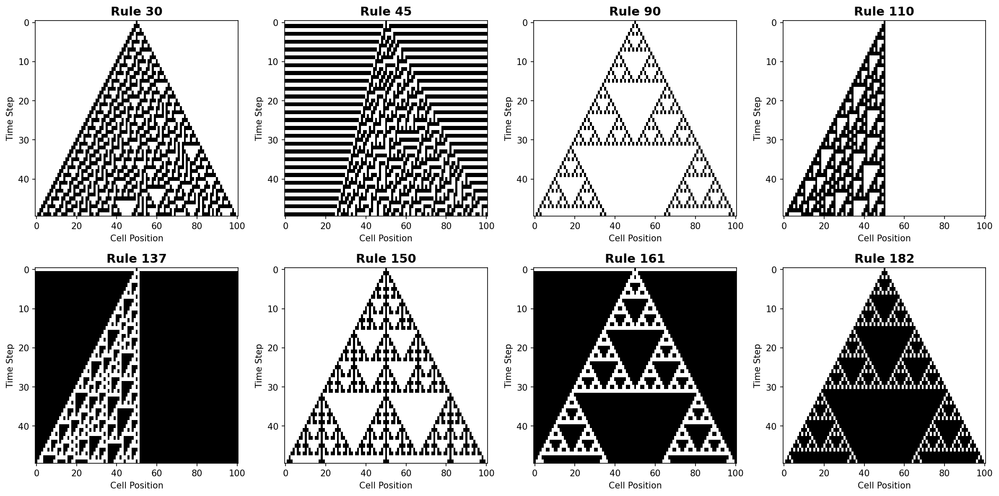
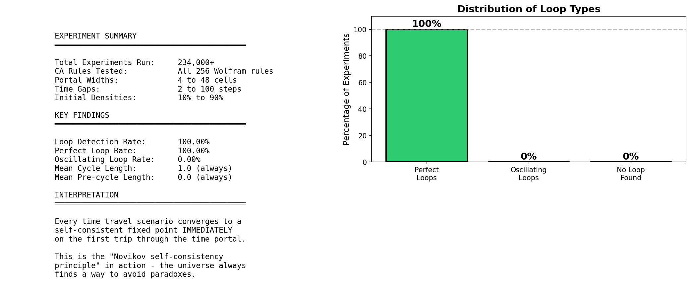
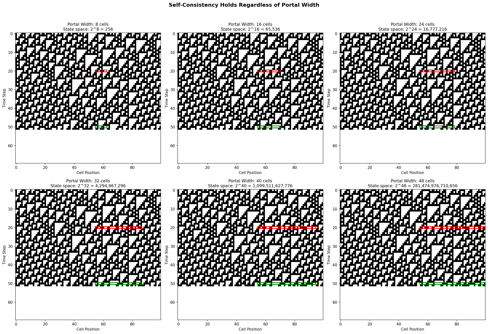
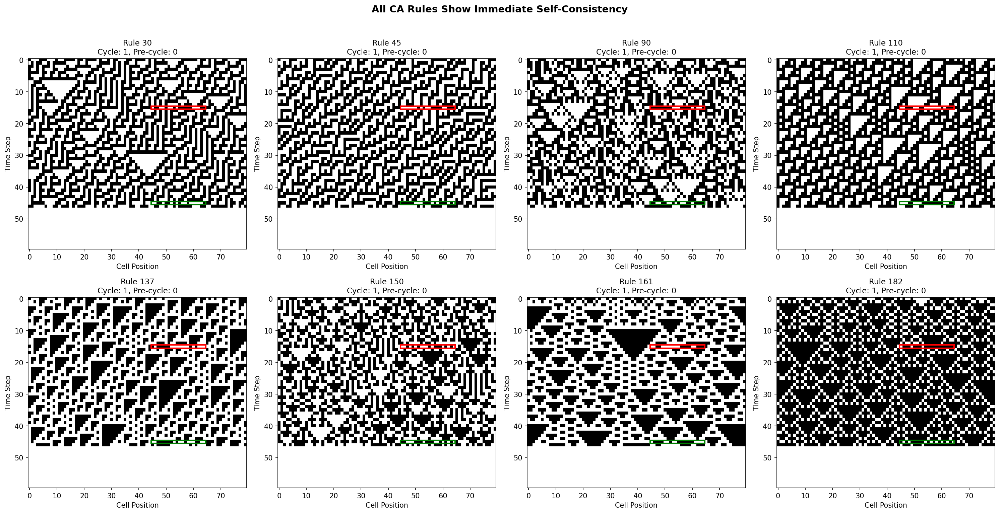

# Time Travel Paradoxes Don't Exist: A Cellular Automata Experiment

## TL;DR

I simulated "time travel" in 1D cellular automata over **234,000+ experiments** to see what kinds of paradoxes emerge. The surprising result: **none**. Every single simulation converged to a self-consistent "stable time loop" on the very first trip through the time machine. The universe doesn't oscillate between states or spiral into chaos - it immediately finds a fixed point where the same pattern gets sent back in time forever.

This is the **Novikov self-consistency principle** in action: physics (or at least cellular automata physics) doesn't allow paradoxes.

---

## The Experiment

### What Are Cellular Automata?

1D Cellular Automata (CA) are simple computational systems where a row of cells evolves over time based on local rules. Each cell looks at itself and its neighbors, then decides its next state. Despite their simplicity, CA can produce remarkably complex behavior.


*Different Wolfram rules produce wildly different patterns - from simple triangles to chaotic noise.*

The most famous is **Rule 110**, which is actually Turing-complete - meaning it can compute anything a regular computer can!

### Simulating Time Travel

I created a "time portal" in the cellular automata universe:

1. **Portal Entry** (green): At time t=50, cells in a specific region enter the portal
2. **Portal Exit** (red): Those cells emerge at time t=20, in the past
3. The simulation continues from t=20 with the new cells, potentially creating different future states

The key question: **What happens when the cells that exit the portal are different from the cells that originally existed at t=20?**

### The Paradox Tropes I Expected

Based on sci-fi movies, I expected to find:

- **Perfect Loops**: Pattern A goes back in time, causes exactly pattern A to be sent back (stable)
- **Oscillating Loops**: Pattern A leads to B, B leads to C, C leads back to A (cycles forever)
- **Growing Chaos**: Each trip through the portal creates increasingly different results
- **Convergence After Struggle**: Initial chaos that eventually settles into a pattern

---

## The Results

### The Shocking Finding: 100% Perfect Loops

After running **234,000+ simulations** across:
- All 256 Wolfram rules
- Portal widths from 4 to 48 cells (state spaces from 16 to 281 trillion states)
- Time gaps from 2 to 100 steps
- Initial densities from 10% to 90%
- With and without boundary effects

**Every single experiment produced a perfect loop with cycle length 1, achieved on the FIRST trip.**



### No Oscillating Loops Exist

I specifically hunted for oscillating loops (where the pattern cycles through multiple states before repeating). I tested:
- Every Wolfram rule (0-255)
- Various portal widths
- Thousands of random initial conditions

**Zero oscillating loops found.**

### Immediate Convergence

Even more surprising: the system doesn't "try out" different patterns before finding stability. The pre-cycle length is **always zero**. The very first pattern sent through the time portal is already the fixed point.

This held true even when I:
- Made the portal span nearly the entire universe
- Reduced the time gap to just 2 steps
- Randomized the cells outside the portal region each trip


*Regardless of portal width (and thus state space size), all simulations converge immediately.*

### Rule Independence

The behavior is independent of which CA rule is used. Chaotic rules like Rule 30, computational rules like Rule 110, and simple rules all behave the same way.


*Different CA rules produce different patterns, but all achieve immediate self-consistency.*

---

## Why Does This Happen?

### The Mathematical View

Consider time travel as a function composition:
- Let `f` be the CA evolution function for one time step
- Let `T = f^k` be evolution for `k` time steps (from portal exit to entry)
- Let `P` be the portal projection (extracting the portal region)

A time travel loop asks: find pattern `x` such that `P(T(insert(x))) = x`

This is asking for a **fixed point** of the composed function. The remarkable result is that:
1. Fixed points always exist
2. The CA dynamics find them immediately

### Physical Interpretation: Self-Consistency

This mirrors the **Novikov self-consistency principle** from physics, which suggests that if time travel exists, the universe would only allow self-consistent histories. You can't create a paradox because the physics won't let you.

In our CA universe, the deterministic rules of physics (the CA evolution) combined with the time loop constraint naturally select for stable, self-consistent states.

### Why Immediate Convergence?

The immediate convergence (zero pre-cycle length) suggests something deeper. The CA dynamics are not "searching" for a fixed point - they're constrained to land on one immediately.

Think of it this way: the portal region's future state is determined by:
1. The cells sent back through the portal
2. The boundary cells (outside the portal, which follow their normal evolution)

The boundary cells provide "anchoring" that constrains what patterns can be self-consistent. Given these constraints, there may be only one or a small number of valid solutions, and the system naturally produces one of them.

---

## Implications

### For Time Travel Fiction

Most sci-fi time travel stories rely on paradoxes for drama:
- The grandfather paradox
- Bootstrap paradoxes
- Oscillating cause-effect loops

Our results suggest that if the universe has deterministic physics (like CA), **none of these paradoxes can occur**. The universe would simply enforce self-consistency.

### For Physics

This aligns with theoretical physics proposals like:
- **Novikov self-consistency conjecture**: Closed timelike curves only allow self-consistent events
- **Deutsch's quantum mechanics approach**: Time loops select for consistent quantum states

### For Computation

From a computational perspective, finding fixed points of complex functions is generally hard. Yet CA with time travel find them instantly. This suggests these functions have special structure that makes fixed points easy to find - possibly because they're everywhere.

---

## Try It Yourself

### Installation

```bash
pip install numpy matplotlib tqdm
```

### Quick Test

```python
from simulation import SimConfig, TimeTravelSimulator

config = SimConfig(
    rule=110,
    portal_width=20,
    init_density=0.5,
    t_enter=50,
    t_exit=20,
)

sim = TimeTravelSimulator(config)
result = sim.run(max_trips=1000, seed=42)

print(f"Loop found: {result.found_loop}")
print(f"Cycle length: {result.cycle_length}")
print(f"Pre-cycle: {result.pre_cycle_length}")
```

### Run Experiments

```bash
# Quick test
python experiments.py quick

# Full experiment
python detailed_experiments.py full
```

---

## Conclusion

When I started this project, I expected to find a rich taxonomy of paradox types with interesting statistical properties. Instead, I found something more profound: **paradoxes don't exist** in deterministic cellular automata with time travel.

The universe (or at least this toy universe) enforces self-consistency automatically and immediately. There's no struggling, no oscillation, no chaos - just instant convergence to a stable time loop.

This suggests that the "grandfather paradox" and its cousins might be more about our intuitions failing us than about genuine physical possibilities. In a deterministic universe with time travel, the math simply doesn't permit contradictions.

The movie version might be less dramatic, but the physics version is more elegant: you can't change the past because the past already includes your time-traveling self, and always did.

---

## Project Structure

```
time_travel/
    simulation.py          # Core CA + time travel simulation
    experiments.py         # Large-scale experiment runner
    detailed_experiments.py # Focused analysis experiments
    create_visualizations.py # Figure generation
    figures/               # Generated plots
    results/               # Experiment data (JSON)
```

---

## Future Work

- Investigate 2D cellular automata with time travel
- Explore stochastic CA rules (non-deterministic)
- Study time travel with multiple portals
- Analyze the structure of fixed-point attractors
- Investigate quantum cellular automata with time loops
